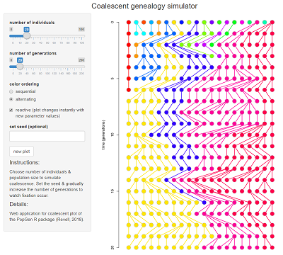
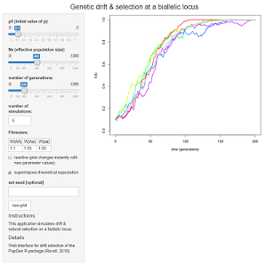
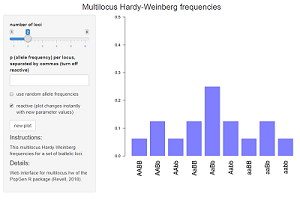
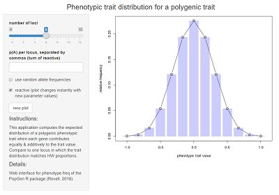
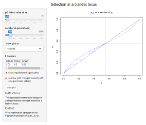

<head>
<title>PopGen web interfaces</title>
</head>

<body>
<h2 align="center">Index of PopGen web interfaces</h2>

This page contains a number of <i><a href="https://CRAN.R-project.org/package=shiny">shiny</a></i> (Chang et al. 
2017) interfaces to functions in the package <i><a href="https://github.com/liamrevell/PopGen">PopGen</a></i>.
<i>PopGen</i> is intended for teaching & learning important concepts in population genetics, evolutionary biology,
quantitative genetics, and evolutionary theory.

For now, all web apps are hosting on the <a href="http://www.shinyapps.io/">shinyapps.io</a> by Rstudio server,
although this may change in the future.

<table border="1">
<tr><td>

1. <a href="https://phytools.shinyapps.io/coalescent-plot/">coalescent-plot</a>: Simulating & plotting coalescent 
genealogies. (Interface for <code>coalescent.plot</code>.) 

</td></tr>

<tr><td>

2. <a href="https://phytools.shinyapps.io/drift-selection/">drift-selection</a>: Simulating simultaneous genetic 
drift & natural selection on a biallelic locus. (Interface for <code>drift.selection</code>.) 

</td></tr>

<tr><td>

3. <a href="https://phytools.shinyapps.io/multilocus-hw/">multilocus-hw</a>: Multi-locus Hardy-Weinberg frequencies
for biallelic loci. (Interface for <code>multilocus.hw</code>.) 

</td></tr>

<tr><td>

4. <a href="https://phytools.shinyapps.io/phenotype-freq/">phenotype-freq</a>: Visualizing phenotypic trait 
distribution for polygenic traits. (Interface for <code>phenotype.freq</code>.) 

</td></tr>

<tr><td>

5. <a href="https://phytools.shinyapps.io/phenotype-freq/">selection</a>: Numerical analysis of selection on
a biallelic locus. (Interface for <code>selection</code>.) 

</td></tr>

</table>

</body>

