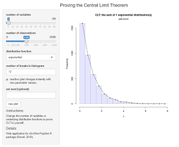
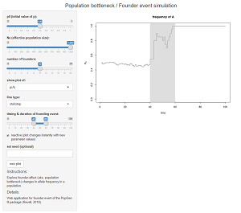
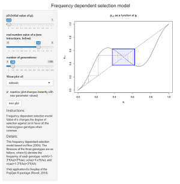
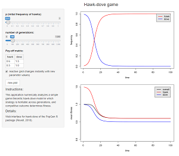
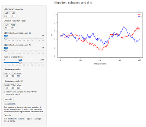

<head>
<title>learnPopGen web interfaces</title>
</head>

<body>
<h2 align="center">Index of learnPopGen web interfaces</h2>

This page contains a number of <i><a href="https://CRAN.R-project.org/package=shiny">shiny</a></i> (Chang et al., 2017) interfaces to functions in the <a href="https://www.r-project.org/">R</a> package <i><a href="https://github.com/liamrevell/learnPopGen">learnPopGen</a></i>.
<i>learnPopGen</i> is intended for teaching & learning important concepts in population genetics, evolutionary biology, quantitative genetics, statistics, and evolutionary theory.

For now, all web apps are hosted on the <a href="http://www.shinyapps.io/">shinyapps.io</a> by Rstudio server, although this may change in the future.

<table cellpadding="5">
<tr valign="top"><td>
1. <a href="https://phytools.shinyapps.io/central-limit-theorem/">central-limit-theorem</a>: Illustration of the 
Central Limit Theorem via simulation. (Interface for <code>clt</code>.) 

</td>

<td>
2. <a href="https://phytools.shinyapps.io/coalescent-plot/">coalescent-plot</a>: Simulating & plotting coalescent 
genealogies. (Interface for <code>coalescent.plot</code>.) 

</td></tr>

<tr valign="top"><td>
3. <a href="https://phytools.shinyapps.io/drift-selection/">drift-selection</a>: Simulating simultaneous genetic 
drift & natural selection on a biallelic locus. (Interface for <code>drift.selection</code>.) 

</td>

<td>
4. <a href="https://phytools.shinyapps.io/founder-event/">founder-event</a>: Simulates changes in allele frequency due to a population bottleneck. (Interface for <code>founder.event</code>.) 

</td></tr>

<tr valign="top"><td>
5. <a href="https://phytools.shinyapps.io/freqdep/">freqdep</a>: Numerical analysis of a simple frequency dependent 
selection model from Rice (2004). (Interface for <code>freqdep</code>.) 

</td>

<td>
6. <a href="https://phytools.shinyapps.io/hawk-dove/">hawk-dove</a>: Numerical analysis of a simple hawk-dove game theoretic model. (Interface for <code>hawk.dove</code>.) 

</td></tr>

<tr valign="top"><td>
7. <a href="https://phytools.shinyapps.io/migration-selection-drift/">migration-selection-drift</a>: Simulation of migration, selection, and genetic drift at a biallelic locus. (Interface for <code>msd</code>.) 

</td>

<td>
8. <a href="https://phytools.shinyapps.io/multilocus-hw/">multilocus-hw</a>: Multi-locus Hardy-Weinberg frequencies
for biallelic loci. (Interface for <code>multilocus.hw</code>.) 

</td></tr>

<tr valign="top"><td>
9. <a href="https://phytools.shinyapps.io/phenotype-freq/">phenotype-freq</a>: Visualizing phenotypic trait 
distribution for polygenic traits. (Interface for <code>phenotype.freq</code>.) 

</td>

<td>
10. <a href="https://phytools.shinyapps.io/phenotype-freq/">selection</a>: Numerical analysis of selection on
a biallelic locus. (Interface for <code>selection</code>.) 

</td></tr>

</table>

All the web applications of this page were made by Liam J. Revell. The contents of this page have been developed with the support of National Science Foundation awards DEB-1350474 and DBI-1759940.

</body>

